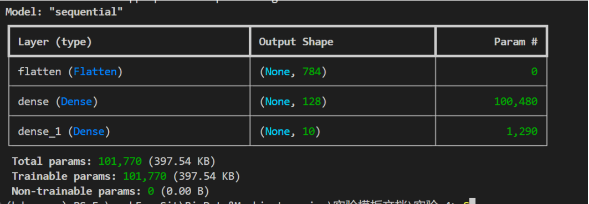
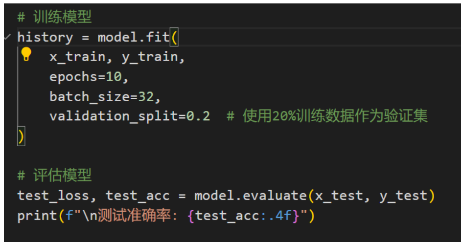
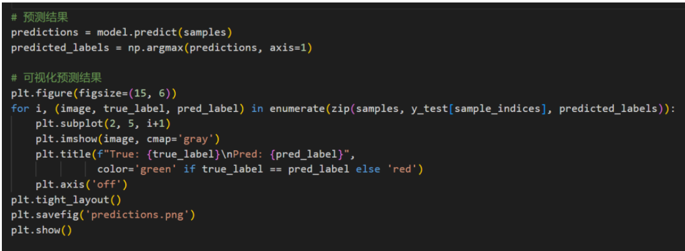
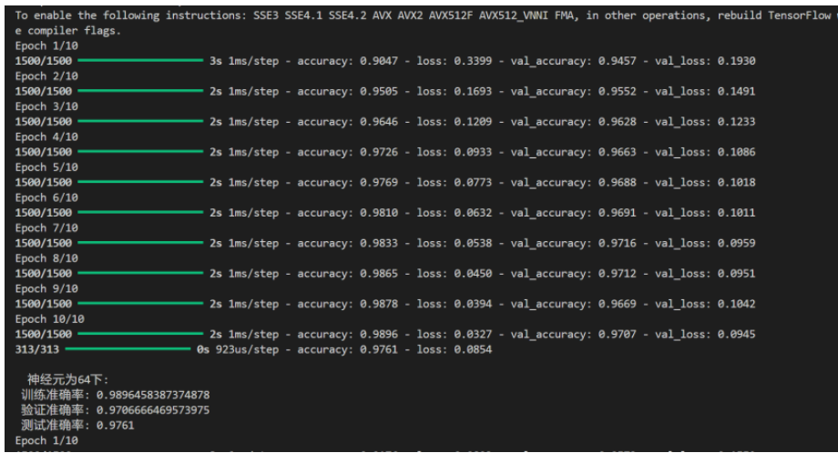

#  《大数据技术与机器学习》课程实验报告

| 实验名称 | 神经网络 | 神经网络 | 神经网络 | 实验序号 | 实验4 | 实验日期 | 2025/10/30 |
| --- | --- | --- | --- | --- | --- | --- | --- |
| 姓名 | 毛梓进 | 院系 | 计算机 | 班级 | 221042Y2 | 学号 | 221042Y234 |
| 专业 | 软件工程 | 软件工程 | 软件工程 | 指导教师 | 朱栩 | 成绩 |  |
| 评语 |  |  |  |  |  |  |  |
| 一、实验目的和要求 | 一、实验目的和要求 | 一、实验目的和要求 | 一、实验目的和要求 | 一、实验目的和要求 | 一、实验目的和要求 | 一、实验目的和要求 | 一、实验目的和要求 |
| 实验名称: 基于神经网络的MNIST手写数字识别 数据集: MNIST手写数字数据集(内置在Keras中) 工具: Python 3.7+、TensorFlow 2.x、Matplotlib 神经网络结构: 输入层 → 全连接隐藏层 → 输出层 实验亮点: 简洁实现(<50行代码)、可视化训练过程、实时预测展示 1. 环境安装与配置。 2. 数据加载与预处理。 3. 构建浅层神经网络。 4. 模型训练与评估 5. 模型预测与交互测试 | 实验名称: 基于神经网络的MNIST手写数字识别 数据集: MNIST手写数字数据集(内置在Keras中) 工具: Python 3.7+、TensorFlow 2.x、Matplotlib 神经网络结构: 输入层 → 全连接隐藏层 → 输出层 实验亮点: 简洁实现(<50行代码)、可视化训练过程、实时预测展示 1. 环境安装与配置。 2. 数据加载与预处理。 3. 构建浅层神经网络。 4. 模型训练与评估 5. 模型预测与交互测试 | 实验名称: 基于神经网络的MNIST手写数字识别 数据集: MNIST手写数字数据集(内置在Keras中) 工具: Python 3.7+、TensorFlow 2.x、Matplotlib 神经网络结构: 输入层 → 全连接隐藏层 → 输出层 实验亮点: 简洁实现(<50行代码)、可视化训练过程、实时预测展示 1. 环境安装与配置。 2. 数据加载与预处理。 3. 构建浅层神经网络。 4. 模型训练与评估 5. 模型预测与交互测试 | 实验名称: 基于神经网络的MNIST手写数字识别 数据集: MNIST手写数字数据集(内置在Keras中) 工具: Python 3.7+、TensorFlow 2.x、Matplotlib 神经网络结构: 输入层 → 全连接隐藏层 → 输出层 实验亮点: 简洁实现(<50行代码)、可视化训练过程、实时预测展示 1. 环境安装与配置。 2. 数据加载与预处理。 3. 构建浅层神经网络。 4. 模型训练与评估 5. 模型预测与交互测试 | 实验名称: 基于神经网络的MNIST手写数字识别 数据集: MNIST手写数字数据集(内置在Keras中) 工具: Python 3.7+、TensorFlow 2.x、Matplotlib 神经网络结构: 输入层 → 全连接隐藏层 → 输出层 实验亮点: 简洁实现(<50行代码)、可视化训练过程、实时预测展示 1. 环境安装与配置。 2. 数据加载与预处理。 3. 构建浅层神经网络。 4. 模型训练与评估 5. 模型预测与交互测试 | 实验名称: 基于神经网络的MNIST手写数字识别 数据集: MNIST手写数字数据集(内置在Keras中) 工具: Python 3.7+、TensorFlow 2.x、Matplotlib 神经网络结构: 输入层 → 全连接隐藏层 → 输出层 实验亮点: 简洁实现(<50行代码)、可视化训练过程、实时预测展示 1. 环境安装与配置。 2. 数据加载与预处理。 3. 构建浅层神经网络。 4. 模型训练与评估 5. 模型预测与交互测试 | 实验名称: 基于神经网络的MNIST手写数字识别 数据集: MNIST手写数字数据集(内置在Keras中) 工具: Python 3.7+、TensorFlow 2.x、Matplotlib 神经网络结构: 输入层 → 全连接隐藏层 → 输出层 实验亮点: 简洁实现(<50行代码)、可视化训练过程、实时预测展示 1. 环境安装与配置。 2. 数据加载与预处理。 3. 构建浅层神经网络。 4. 模型训练与评估 5. 模型预测与交互测试 | 实验名称: 基于神经网络的MNIST手写数字识别 数据集: MNIST手写数字数据集(内置在Keras中) 工具: Python 3.7+、TensorFlow 2.x、Matplotlib 神经网络结构: 输入层 → 全连接隐藏层 → 输出层 实验亮点: 简洁实现(<50行代码)、可视化训练过程、实时预测展示 1. 环境安装与配置。 2. 数据加载与预处理。 3. 构建浅层神经网络。 4. 模型训练与评估 5. 模型预测与交互测试 |
| 二、实验预习内容 ● 神经网络结构: 输入层→隐藏层→输出层 ● MNIST 数据集: 6万张 28×28 手写数字图片 ● 全连接层原理: 每个神经元与上一层全连接 ● 激活函数作用: ReLU(隐藏层)、Softmax(输出层) ● 输入层: 接收 784 个像素值 ● 隐藏层: 特征提取和学习 ● 输出层: 10 个数字的概率输出 | 二、实验预习内容 ● 神经网络结构: 输入层→隐藏层→输出层 ● MNIST 数据集: 6万张 28×28 手写数字图片 ● 全连接层原理: 每个神经元与上一层全连接 ● 激活函数作用: ReLU(隐藏层)、Softmax(输出层) ● 输入层: 接收 784 个像素值 ● 隐藏层: 特征提取和学习 ● 输出层: 10 个数字的概率输出 | 二、实验预习内容 ● 神经网络结构: 输入层→隐藏层→输出层 ● MNIST 数据集: 6万张 28×28 手写数字图片 ● 全连接层原理: 每个神经元与上一层全连接 ● 激活函数作用: ReLU(隐藏层)、Softmax(输出层) ● 输入层: 接收 784 个像素值 ● 隐藏层: 特征提取和学习 ● 输出层: 10 个数字的概率输出 | 二、实验预习内容 ● 神经网络结构: 输入层→隐藏层→输出层 ● MNIST 数据集: 6万张 28×28 手写数字图片 ● 全连接层原理: 每个神经元与上一层全连接 ● 激活函数作用: ReLU(隐藏层)、Softmax(输出层) ● 输入层: 接收 784 个像素值 ● 隐藏层: 特征提取和学习 ● 输出层: 10 个数字的概率输出 | 二、实验预习内容 ● 神经网络结构: 输入层→隐藏层→输出层 ● MNIST 数据集: 6万张 28×28 手写数字图片 ● 全连接层原理: 每个神经元与上一层全连接 ● 激活函数作用: ReLU(隐藏层)、Softmax(输出层) ● 输入层: 接收 784 个像素值 ● 隐藏层: 特征提取和学习 ● 输出层: 10 个数字的概率输出 | 二、实验预习内容 ● 神经网络结构: 输入层→隐藏层→输出层 ● MNIST 数据集: 6万张 28×28 手写数字图片 ● 全连接层原理: 每个神经元与上一层全连接 ● 激活函数作用: ReLU(隐藏层)、Softmax(输出层) ● 输入层: 接收 784 个像素值 ● 隐藏层: 特征提取和学习 ● 输出层: 10 个数字的概率输出 | 二、实验预习内容 ● 神经网络结构: 输入层→隐藏层→输出层 ● MNIST 数据集: 6万张 28×28 手写数字图片 ● 全连接层原理: 每个神经元与上一层全连接 ● 激活函数作用: ReLU(隐藏层)、Softmax(输出层) ● 输入层: 接收 784 个像素值 ● 隐藏层: 特征提取和学习 ● 输出层: 10 个数字的概率输出 | 二、实验预习内容 ● 神经网络结构: 输入层→隐藏层→输出层 ● MNIST 数据集: 6万张 28×28 手写数字图片 ● 全连接层原理: 每个神经元与上一层全连接 ● 激活函数作用: ReLU(隐藏层)、Softmax(输出层) ● 输入层: 接收 784 个像素值 ● 隐藏层: 特征提取和学习 ● 输出层: 10 个数字的概率输出 |
| 三、实验项目摘要 1. 加载数据集与模型构造 代码如下 | 三、实验项目摘要 1. 加载数据集与模型构造 代码如下 | 三、实验项目摘要 1. 加载数据集与模型构造 代码如下 | 三、实验项目摘要 1. 加载数据集与模型构造 代码如下 | 三、实验项目摘要 1. 加载数据集与模型构造 代码如下 | 三、实验项目摘要 1. 加载数据集与模型构造 代码如下 | 三、实验项目摘要 1. 加载数据集与模型构造 代码如下 | 三、实验项目摘要 1. 加载数据集与模型构造 代码如下 |

#  加载数据集

##  搭建神经网络

设置优化器、损失函数、量化指标

##  神经网络参数结构

##  2. 训练并验证

总体包含一个输入层一个输出层以及一个隐藏层

训练并评估

训练过程中准确率和损失的变化

##  3. 预测

预测并展示

预测结果

预测结果展示

记录最终测试准确率

思考：神经网络各层的作用是什么？

答：分为输入层、输出层和隐藏层。输入层负责接受外部数据输入，输出层则是输出具体的需要求(分类等任务)，隐藏层负责对输入的特征提取。

尝试：修改隐藏层神经元数量（64或256）观察效果变化

对每个参数分别建立模型

结果

| 神经元为64下: |  |
| --- | --- |
| 训练准确率: 0.9896458387374878 |  |
| 验证准确率: 0.9706666469573975 |  |
| 测试准确率: 0.9761 |  |
| 神经元为64 | 神经元为64 |
| 神经元为128下: | 神经元为128下: |
| 训练准确率: 0.9950624704360962 | 训练准确率: 0.9950624704360962 |
| 验证准确率: 0.9726666808128357 | 验证准确率: 0.9726666808128357 |
| 测试准确率: 0.9755 | 测试准确率: 0.9755 |
| 神经元为128 | 神经元为128 |
| 神经元为256下: | 神经元为256下: |
| 训练准确率: 0.9956874847412109 | 训练准确率: 0.9956874847412109 |
| 验证准确率: 0.976999980926514 | 验证准确率: 0.976999980926514 |
| 测试准确率: 0.9787 | 测试准确率: 0.9787 |
| 神经元为256 | 神经元为256 |
| 使用三种神经元数量如下: 实验结论 | 使用三种神经元数量如下: 实验结论 |
| 1. 神经元数量增加确实提升性能:从64→256神经元,测试准确率从97.61%提升到97.87% | 1. 神经元数量增加确实提升性能:从64→256神经元,测试准确率从97.61%提升到97.87% |
| 2. 没有严重过拟合:所有配置的训练-测试差距都在2%以内,说明模型训练良好 | 2. 没有严重过拟合:所有配置的训练-测试差距都在2%以内,说明模型训练良好 |
| 3. 推荐使用256神经元配置:在该问题中,更大的模型容量带来了更好的泛化性能 | 3. 推荐使用256神经元配置:在该问题中,更大的模型容量带来了更好的泛化性能 |
| 成功实现了基于全连接神经网络的MNIST手写数字识别,通过对比不同神经元数量(64,128, 256)对模型性能的影响。 | 成功实现了基于全连接神经网络的MNIST手写数字识别,通过对比不同神经元数量(64,128, 256)对模型性能的影响。 |
| 核心发现 | 核心发现 |
| 1. 神经元数量与性能关系: 训练准确率: 256神经元(99.57%) >128神经元(99.51%) >64神经元(98.96%) | 1. 神经元数量与性能关系: 训练准确率: 256神经元(99.57%) >128神经元(99.51%) >64神经元(98.96%) |
| 测试准确率: 256神经元(97.87%) >64神经元(97.61%) >128神经元(97.55%) | 测试准确率: 256神经元(97.87%) >64神经元(97.61%) >128神经元(97.55%) |
| 过拟合控制: 所有模型都表现出良好的泛化能力 | 过拟合控制: 所有模型都表现出良好的泛化能力 |
| 训练-测试准确率差距均在合理范围内(1.35%-1.96%) | 训练-测试准确率差距均在合理范围内(1.35%-1.96%) |
| 最佳配置: 256个神经元 测试准确率最高(97.87%) | 最佳配置: 256个神经元 测试准确率最高(97.87%) |
| 泛化能力最好 | 泛化能力最好 |

注:空间不够，可以增加页码。